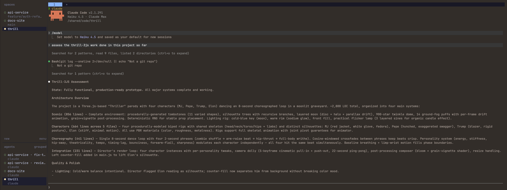
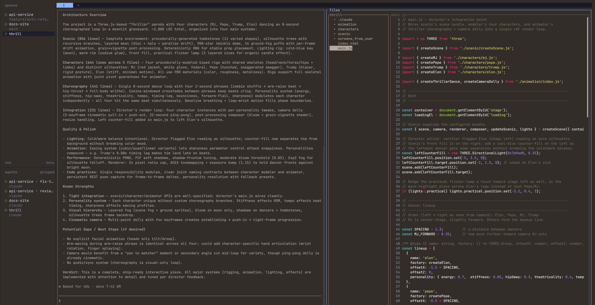

# herdr agent workstation

**A terminal workspace where coding agents have centre stage and editing files is the side part.**

*Default view: the agent gets the screen. The sidebar lists spaces (projects) and every agent in them; a dot lights up when one needs you.*

*When you need files: open the file viewer beside the agent (`prefix+f`), read the code or the diff, close it again.*

An IDE is built for writing code, with agents attached as a panel. This setup flips that. Agents (Claude Code, Codex, …) run on a dev server inside [herdr](https://herdr.dev), a terminal multiplexer that knows about agents. The sidebar lights up when one is `blocked` and needs you, across every project. A file viewer, diff review, editor and markdown preview sit **beside** the agents. You attach from your desktop with `herdr --remote`, and close the lid without stopping anything.

What you get:

- **Agents first.** One sidebar shows which agent is working, blocked or done, across every project.
- **Persistent.** Everything lives on the server; your desktop only draws it. Detach, lose wifi, switch machines: agents keep going.
- **Files when you want them, gone when you don't.** One key opens a git-aware file viewer beside the agent and closes it again. Markdown previews GitHub-style in your browser; images draw inline.
- **Point at code, hand it to the agent.** Comment on diff lines and send them straight into the agent's input ([reviewr](https://github.com/persiyanov/herdr-reviewr): `c`, then `s`), or annotate lines in the file viewer and paste the notes, each with its file and line range (`L`, `a`, then `A` `y`).
- **Small parts you can swap.** Helix, delta, bat, glow, go-grip, three plugins. Swap any of them.
- **Fast and light.** Terminal-native, instant response, no IDE process on top of the agents.

## Why not just use…

The question that decides it: **is your day mostly writing code, or mostly directing and reviewing agents?** If it's the second, you want a tool built around agents, with files on the side.

| | Centre of the screen | Agents across projects | Survives disconnect | Files & diffs beside the agent |
|---|---|---|---|---|
| **Zed, VS Code, Cursor** | the editor; agents are a panel or a terminal tab | one window per project; no overview of which agent needs you | agents in an editor terminal are tied to that editor session; many people wrap them in tmux to be safe | yes, the IDE's strength |
| **Claude Desktop (Code)** | the conversation | a flat "Recents" list of sessions, not grouped by project and no view of who needs you | can run on your machine or a dev box (`/remote`) | you can comment on Claude's *plan*, but there's no file tree, no editor, no diff: file work shows up as "Created a file ›", and you can't open your own file and point at its lines |
| **tmux / zellij** | whatever you put there | panes don't know what an agent is, so nothing tells you who's blocked | yes | only what you wire up yourself |
| **This setup (herdr)** | the agent, with files one key away | every agent in every space, with `working` / `blocked` / `done` | yes: the server owns everything, your desktop only draws it | file viewer, diff review, editor and markdown preview one key away |

**When to pick the others instead:**
- **Zed / VS Code / Cursor:** long stretches of hand-writing code, heavy refactoring, debuggers, rich LSP UI, a git UI you click around in. They're still the better editors; this setup keeps a terminal editor (Helix) for quick edits.
- **Claude Desktop:** you trust the agent end to end and rarely need to look at files, or you don't want a terminal at all.
- **Plain tmux:** you already have muscle memory and don't need to see agent state at a glance.

This setup sits between the two: like Claude Desktop, the agent gets the screen; like an IDE, the files are right there when you need to check something or point at a line. Toggling the file viewer is the whole trick.

You can mix them: open the same repo in your IDE for a deep editing session while agents keep running in herdr.

## This repo is a spec, not an installer

Everyone's machines, shells and agents differ, so there's no install script to run blind. Instead:

1. **[`SPEC.md`](SPEC.md)**: the target end state, the invariants that make it work (each one learned the hard way), optional features, and a verification checklist.
2. **[`AGENT_BRIEF.md`](AGENT_BRIEF.md)**: a brief you fill in and hand to **your** coding agent. It does recon, installs, verifies, and hands you the checks only a human can do.
3. **[`reference/`](reference/)**: working scripts and configs from one real setup, to copy or adapt.

The usual flow: clone this repo, fill in the blanks in `AGENT_BRIEF.md`, and tell your agent *"read SPEC.md and AGENT_BRIEF.md and set this up."* Change the brief as much as you like: other editors, agents, plugins, keys.

## Known gotchas (the short version)

All of these are in [`SPEC.md`](SPEC.md#invariants) with fixes:

- **`PATH` only set in `.zshrc`/`.bashrc`.** herdr's server and plugins can't find your tools, because they start from a non-interactive SSH command.
- **A tmux auto-attach hook in your shell rc.** Every herdr pane silently attaches to your tmux session. Guard it with `HERDR_ENV`.
- **Custom key bindings do nothing in `--remote`.** By default the client's bindings are used and plugin bindings aren't sent. Attach with `--remote-keybindings server`.
- **`ctrl+b`** is both herdr's prefix and Claude Code's "background this command". Press `ctrl+b ctrl+b`, or change the prefix.
- **A missing locale or an overridden `TERM`.** You get garbled box drawing, or images that never render.
- **Image paste needs image data**, not a copied file. Use plain `ctrl+v`, not the terminal's text-paste shortcut.

## Reference stack

| Piece | Used here |
|---|---|
| Multiplexer | [herdr](https://herdr.dev) |
| Client terminal | [kitty](https://sw.kovidgoyal.net/kitty/) (any kitty-graphics terminal works) |
| Editor | [Helix](https://helix-editor.com) + language servers |
| Renderers | [delta](https://github.com/dandavison/delta), [bat](https://github.com/sharkdp/bat), [glow](https://github.com/charmbracelet/glow) |
| Plugins | [herdr-file-viewer](https://github.com/smarzban/herdr-file-viewer), [herdr-reviewr](https://github.com/persiyanov/herdr-reviewr), [herdr-whichkey](https://github.com/Qu4tro/herdr-whichkey) |
| Markdown preview | [go-grip](https://github.com/chrishrb/go-grip) |
| Network | [Tailscale](https://tailscale.com) (any private network works) |

Thanks to the authors of all of the above. This repo only wires them together.

## License

[MIT](LICENSE)
